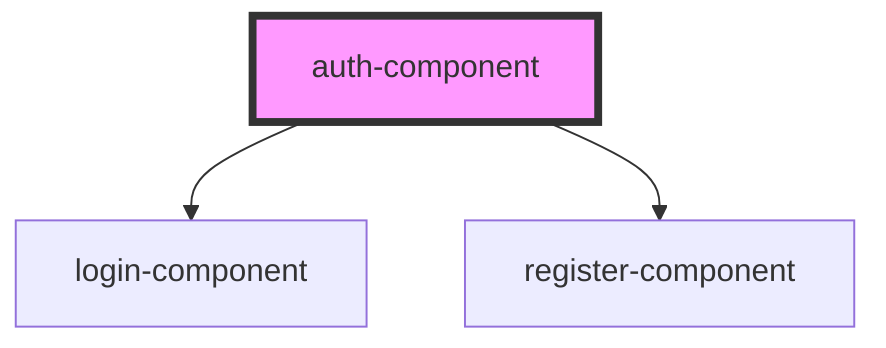

# auth-component

<!-- Auto Generated Below -->

## Properties

| Property | Attribute | Description | Type     | Default     |
| -------- | --------- | ----------- | -------- | ----------- |
| `proxy`  | `proxy`   |             | `string` | `undefined` |

## Dependencies

### Depends on

- [login-component](../login-component)
- [register-component](../register-component)

### Graph

----------------------------------------------

*Built with [StencilJS](https://stenciljs.com/)*
