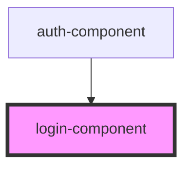

# login-component

<!-- Auto Generated Below -->

## Properties

| Property          | Attribute | Description | Type                   | Default     |
| ----------------- | --------- | ----------- | ---------------------- | ----------- |
| `changeRoute`     | --        |             | `() => void`           | `undefined` |
| `proxy`           | `proxy`   |             | `string`               | `undefined` |
| `setWrapperState` | --        |             | `(token: any) => void` | `undefined` |

## Dependencies

### Used by

 - [auth-component](../auth-component)

### Graph

----------------------------------------------

*Built with [StencilJS](https://stenciljs.com/)*
